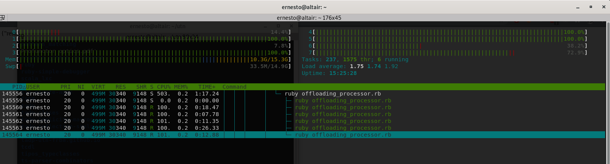

# Ejemplo final

## Requisitos

- Ruby head [Ruby 3+]
- Puma
- Redis

## Como correr este ejemplo

Solo hay que hacer `bundle install` para instalar las dependencias que estan presentes en el directorio base. Una vez que tengamos instaladas las dependencias y la version de ruby con [RVM](https://rvm.io/), hay que ejecutar en el segundo plano nuestro servicio de Redis que solo servira como cola de mensajes, podemos levantar la misma con el siguiente comando:

```bash
docker-compose up
```

Una vez que esta levantado, podemos levantar nuestro offloader que sera el que procese asincronicamente workers, utilizando una cantidad de n workers, que vamos a especificar en el archivo de configuracion `config.yml`. Cada worker, ejecutara un loop dentro de un `Ractor`, y el 


Una vez que estamos listos, podemos correr Puma con un solo worker:

```bash
bundle exec puma  -t 1:4 -w 1 -p 5000
```

La idea es que Puma solo sea un intermediario entre el sistema y el offloader, que sera el que realice todo el procesamiento, esto es valido solo para la ruta `GET /async_fibonacci/:n`.

Cuando se realiza un request sobre esta ruta, lo que sucede es que el calculo de cada fibonacci, de 0 al n pasado por parametro, es encolado en la cola `` de Redis, que sera leido por el offloader. Luego el offloader lo pasara a un pipeline Ractor intermedio donde los n workers iran tomando el proximo dato a procesar, junto con el worker a llamar, y llamara al worker correspondiente, y ahi si se ejecutara 
en el ractor correspondiente.

Si hacemos un request del tipo

```
GET http://localhost:5000/async_fibonacci/47
```

vamos a ver en el htop, algo como lo siguiente:



Lo interesante es que mas de uno de los OS threads de la instancia de la VM estan al 100%, y estan corriendo en disferentes threads, lo que indicaria que al estar cada thread de sistema operativo siendo utilizado por un Guild, el resultado de utilizar Guilds, es que cada Guild creado tiene asignado un Thread OS que no utilizara el GVL de la VM, pero tendra un lock similar a nivel de Guild. El mismo permite que solo un `thread de Ruby` se ejecute al mismo tiempo, pero sin tener intervencion con el GVL de MRI. Con esto, aquellos OT Threads que sean parte de un Ractor, podran ser ejecutados en paralelo, sin mayores problemas.